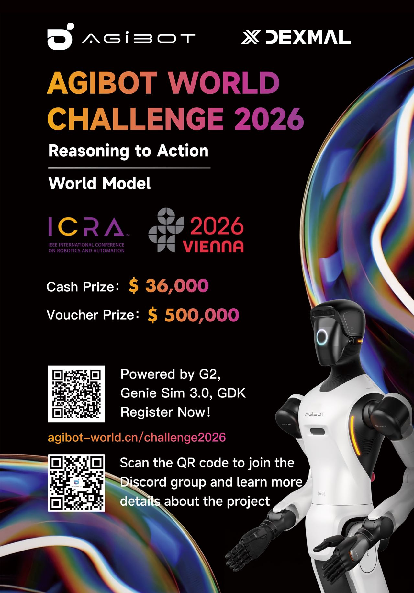

# AGIBOT World Challenge @ ICRA 2026



An embodied AI benchmark challenge for robotics, featuring two tracks:

- **Reasoning–Action Track**
- **World Model Track**

The finals will take place at **ICRA 2026 in Vienna**.

---

## Overview

The AGIBOT World Challenge aims to benchmark embodied intelligence in robotics by evaluating systems that integrate:

- perception
- reasoning
- planning
- action

This repository serves as the official technical entry point for challenge information, baseline code, and future updates.

---

## Tracks

### 1. Reasoning–Action Track
Focus on decision-making and action generation for embodied robotic agents.

### 2. World Model Track
Focus on predictive modeling of environment dynamics and robot interaction.

---

## Repository Structure

```text
.
├── assets/           # Posters and static media
├── docs/             # Challenge documents
├── data/             # Dataset description and expected structure
├── scripts/          # Evaluation and demo entry points
├── src/              # Source code
├── requirements.txt  # Python dependencies
└── CONTRIBUTING.md   # Contribution and collaboration notes
